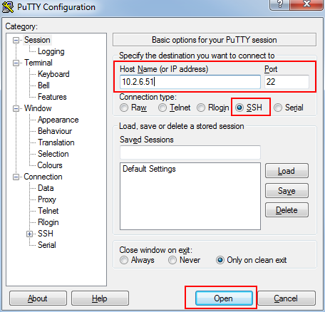
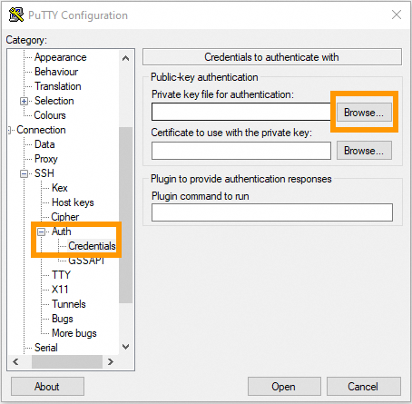

# Deploy an OpenShift Cluster

In this lab, we will follow a step-by-step walkthrough for installing and configuring an OpenShift environment on Amazon Web Services (AWS). We'll guide you through the essential elements for a successful installation, from spinning up an AWS instance to configuring your Red Hat OpenShift environment. We'll cover every detail to ensure you can efficiently deploy and run containerized applications.


## Prerequisites

### Cloud Platform 

In this lab, we have decided to use AWS as the cloud provider, but remember that OpenShift can be deployed in other cloud vendors if desired. The following list shows the SNO support cloud providers and their CPU architectures:

- **Amazon Web Service (AWS):** x86_64 and aarch64
- **Google Cloud Platform (GCP):** x86_64 and aarch64
- **Microsoft Azure:** x86_64

Depending on the cloud provider you choose, the steps described can vary slightly, so if you decide not to use AWS, we strongly encourage you to use this guide as a reference and supplement it with the official documentation.


### AWS Route53 DNS

**The DNS has already been set up for you for this training, but we have included steps for doing this on your own to provide complete instructions.**

OpenShift uses DNS and requires a DNS domain to install. 

The need to utilize Route 53 when installing OpenShift on AWS stems from the critical importance of efficiently managing domain names and DNS resolution to ensure accessibility and connectivity for OpenShift components.

In the AWS context, Route 53 uses "hosted zones" as containers for DNS records of a specific domain. Each hosted zone in Route 53 stores information about how a particular domain name should be resolved.

1. Sign in to the [AWS Management Console](https://console.aws.amazon.com/).
2. Navigate to **Services** in the upper-left corner.
3. Select **Networking & Content Delivery** in the drop-down menu, and click **Route 53**.

[](https://developers.redhat.com/sites/default/files/image2_19.png)


1. Now, go to **Registered domains** on the left side of the dashboard. There, you should see a “No domains to display” message.
2. Click **Register domains** in the upper-right corner, type your preferred domain name (e.g., innovtrain.org), and click **Search**.
3. At this point, you should see your domain name ready to purchase if it is available or a list with suggested domains if it is unavailable. Select the domain name you want to purchase and click **Proceed to checkout**.
4. On the following page, you will need to complete your information using some parameters like the ones listed below. Then, click **Next** to navigate through the different sections.
   - **Domain pricing options**: domain name, duration, auto-renew.
   - **Contact information**: organization, name, email, etc.
5. Before clicking **Submit**, you should see this message: “Route 53 automatically creates a hosted zone for each new domain you register.” This means that once you have purchased the new domain, you don't need to worry about creating the hosted zone, as AWS will set it up automatically.
6. You will receive an email when your domain gets approved.
7. Finally, navigate again to **Services** > **Networking & Content Delivery** > **Route 53** to verify that the hosted zone is present. 

[](https://developers.redhat.com/sites/default/files/image6_9.png)

And that's all you need to configure your Route 53 service correctly. Now we can continue with the next step, creating an IAM user.


### Create an IAM user 

**As with the DNS, for this lab environment, the IAM user and permissions have already been completed.** The following steps are for reference only. 

When the AWS account was created, it was provisioned with a highly privileged account. However, to add an additional layer of security and facilitate the management and auditing of the accesses and actions performed by OpenShift on the AWS infrastructure, a specific IAM user for OpenShift on AWS is recommended.

1. In the [AWS Web Console](https://console.aws.amazon.com/), navigate again to **Services** in the upper-left corner.

2. Click **Security, Identity & Compliance,** and select the **IAM** option. 

   [](https://developers.redhat.com/sites/default/files/image1_37.png)

   

3. Go to the **Users** page on the left column in the IAM Dashboard.

4. Click **Create user** in the upper-right corner.

5. In the **User name** field, type `os-user` (use the name of your new user). Then, click **Next**.

6. Verify that the **Add user to group** box is selected. We need to give it some privileges.

7. Select **Create group** and follow this setup:

   - **User group name**: admin.
   - Check the **AdministratorAccess** policy.

   [](https://developers.redhat.com/sites/default/files/image5_10.png)

   

8. Click **Create user group** again, and you will be redirected to the user creation form.

9. Select the new **admin** group name.

10. Click **Next**, review your choices, and complete the creation by clicking **Create user**.

11. Back on the **Users** page, select your new user. In my case, I’ll select **os-user**.

12. There, you will find some information about the user. Navigate to the **Security credentials** tab.

13. Scroll down to the Access keys section and select **Create access key**.

14. Check the **Command Line Interface (CLI)** option.

15. Check the Confirmation box at the bottom and click **Next**.

16. You can skip the description tag step and click **Create access key**.

17. Copy the **Access key** and the **Secret access key**, as you will use them in the future to fire up the SNO installation. You won’t have access to the secret later, so it’s very important that you complete this step.

18. To close this window, click **Done**.

With that, we have completed most of the prerequisites for the SNO installation. We have ensured that our network connections are configured thanks to the hosted zone and the Route 53 service, and we have created our OpenShift Container Platform (OCP) user with admin privileges. Now, it's time to create the machine from which we will launch the installation.


### Creating the installation host 

**For this class, the lab environment has already been provisioned. These steps are for reference only.**

To ensure that everyone following this lab can complete the process from start to finish, we will create an AWS instance to avoid possible hardware limitations.

**Note**: You can also use your personal computer as the bastion node.

1. Navigate to the [AWS Console](https://console.aws.amazon.com/).
2. In the upper-left corner, click again on **Services**.
3. In the drop-down menu, click **Compute** and then **EC2** on the right side to create the virtual server.
4. On the **Resources** dashboard, press **Launch instance**.
5. Complete the following fields:
   - **Name**: `host` (insert any preferred name).
   - **Amazon Machine Image (AMI)**: `Amazon Linux 2023 AMI`.
   - **Architecture**: `64-bit (x86)` (you can use Arm architecture if preferred).
   - **Instance type**: `c5.2xlarge`. This instance has enough resources to manage the installation of our SNO, but feel free to use a more convenient one for you.
   - Key pair: This will be used to connect to the machine. Click **Create new key pair** and configure it:
     - **Key pair name**: `os-key` (type any preferred name).
     - **Key pair type**: `RSA`.
     - **Private key file format**: `.pem` (as we will be using ssh to connect).
   - Once completed, click **Create key pair**. The download process will start automatically.
   - On the Networking settings section, click **Edit** and complete the following fields:
     - **VPC**: Go to the [VPC dashboard](https://console.aws.amazon.com/vpcconsole/home?#CreateDefaultVpc:) and click **Create default VPC**. Go back to the **Networking** page, and click the Refresh arrow to automatically detect your new VPC.
     - **Subnet**: Click the Refresh arrow, and `No Preference` will be selected automatically.
     - **Auto-assign public IP**: `Enable`.
     - For the Firewall set up, check the **Create security group** box.
   - **Configure storage**: 1x8GiB gp3 Root volume.

[](https://developers.redhat.com/sites/default/files/image9_3.png)


1. On the right side, you can now press **Launch instance**. Wait until the creation finishes successfully.

2. Select **Connect to your instance**. This will open a new tab.

3. Navigate to the **SSH client** tab where the steps to connect using SSH are described. Copy the command displayed at the bottom.

4. Open a new terminal and give the keys file the right permissions. Then, paste the command. Remember to modify the path to your keys file.

   ```plaintext
   chmod 400 ~/Downloads/os-keys.pem
   ```

   

   ```plaintext
   ssh -i ~/Downloads/os-keys.pem ec2-user@ec2-16-171-254-104.eu-north-1.compute.amazonaws.com
   ```

We have just created and connected to our host machine. From here, the following steps will be done from this AWS machine as we will use it to launch the installation.

---

## START LAB 

After completing all of the prerequisites, it's time to connect to the bastion host. 

At the top of the lab page, click **View on GitHub**. Click the green **Code** button in the top right corner, then click **Download as zip**. 
Once the download is done, extract the zip file and put it somewhere you can easily access it.


### Mac/Linux

The username for SSH is    
`ec2-user`

Open a terminal and `cd` to the extracted lab directory. Inside the directory, you will see a `keys` directory. Enter it using `cd` and run the following commands.

### Set permission on SSH key 

```
chmod 600 lab.pem
```

### SSH to lab servers 

```
ssh -i lab.pem <user>@<VM IP> 
```

### Set up Putty

If you don't already have it, download Putty from [here](https://the.earth.li/~sgtatham/putty/latest/w64/putty.exe) and save it to your desktop. 

Open Putty and configure a new session.




Expand Connection -> SSH -> Auth -> Credentials, click "Browse", and then choose the `lab.ppk` file from the extracted lab directory




Remember to save your session. 


After SSH'ing to the lab VM continue with the lab.


### SSH key pair creation

During the installation, we will need to supply an SSH public key to the installation program. This key will be transmitted to the node and serve as a means of authenticating SSH access to it. Subsequently, the key is appended to the `~/.ssh/authorized_keys` list for the `core` user in the node, enabling password-less authentication. 

1. In your terminal, run the following command to create the SSH keys:

   ```plaintext
   ssh-keygen -t ed25519 -N '' -f ${HOME}/.ssh/ocp4-aws-key
   ```

   

2. Now, check and copy your new public key:

   ```plaintext
   cat ${HOME}/.ssh/ocp4-aws-key.pub
   ```

   

With this, the SSH keys have been generated, and we can use them during the installation.


## Installing the OCP client and getting the installation program

We are almost ready to go! It's time to install the `oc` client and download the installation program to our AWS instance.

1. Navigate to the [Red Hat Hybrid Cloud Console](https://console.redhat.com/openshift) and log in using your Red Hat credentials.
2. On the left panel, navigate to the **Downloads** page.
3. Locate the **OpenShift command-line interface (oc)**. Select **Linux** as the OS system and your architecture type.

[](https://developers.redhat.com/sites/default/files/image8_2.png)


1. Right-click or command-click the **Download** button and select **Copy Link Address**.

2. Back in the terminal, ensure you are connected to the AWS host machine and run the following command. Remember to paste the Link Address copied before:

   ```plaintext
   wget <address you copied>
   ```

   

3. Back in the Hybrid Cloud Console, scroll down until you spot **OpenShift for x86_64 Installer**. Again, select **Linux** as the OS.

[](https://developers.redhat.com/sites/default/files/image3_22.png)


1. Instead of left-clicking Download, right-click or command-click the **Download** button and select **Copy Link Address**.

2. In the Terminal window, run the following command:

   ```plaintext
   wget <address you copied>
   ```

   

3. Once both downloads finish, unzip the files:

   ```plaintext
   tar -xvf openshift-client-linux.tar.gz
   tar -xvf openshift-install-linux.tar.gz
   ```

   


All good? Now, we can confirm that we are ready to deploy the OpenShift cluster.


## Single node deployment

The moment has arrived. We will have our cluster deployed and ready to work in a matter of minutes.

1. To complete the installation for `oc`, `kubectl`, and `openshift-install`, move the extracted files to the user path:

   ```plaintext
   sudo mv oc kubectl openshift-install /usr/local/bin
   ```

   

2. To check the version you will be installing, run:

   ```plaintext
   openshift-install version
   ```

   

1. On the terminal, you will need to create a config file to specify the cluster details. Run:

   ```plaintext
   openshift-install create install-config --dir=./
   ```

   

2. Use the arrow keys in your keyboard and select the following configuration:

   - **SSH Public Key**: `/home/ec2-user/.ssh/ocp4-aws-key.pub`.
   - **Platform**: `aws`.
   - **AWS Access Key ID**: Paste the one provided by the instructor.
   - **AWS Secret Access Key ID**: Paste the one provided by the instructor.
   - **Region**: Select the region where the host was created (`us-west-1`).
   - **BaseDomain**: Select your domain (`innovteach.com`).
   - **Cluster name**: Name the cluster `student<#>`, replacing `#` with the number assigned to you by the instructor.
   - **Pull Secret**: Copy and paste your pull secret from the [Hybrid Cloud Console](https://console.redhat.com/openshift/downloads#tool-pull-secret).

3. Now you can take a look at the newly created config file:

   ```plaintext
   vi install-config.yaml
   ```

   

4. To deploy  OpenShift, in the `install-config.yaml`file the `controlPlane.replicas` and `compute.replicas` settings  should be set to `1`. Also, we need to specify the EC2 instance type.

   ```
      compute:
              - architecture: amd64
                hyperthreading: Enabled
                name: worker
                platform: {}
                replicas: 1
              controlPlane:
                architecture: amd64
                hyperthreading: Enabled
                name: master
                platform:
                  aws:
                    type: m6i.2xlarge
                replicas: 1
               
   ```

   

5. Finally, run the installation command. The installer will use the configuration file we just modified:

```plaintext
openshift-install create cluster --dir=./ --log-level=debug
```


1. When the installation finishes, the installer will provide you the kubeadmin user, password, and OpenShift Web Console URL. Note them down.

2. In order to access your cluster using terminal utilities, run the following command to export the `kubeconfig` file:

   ```plaintext
   export KUBECONFIG=/home/ec2-user/auth/kubeconfig
   ```

To make this permanent, add it to `~/.bashrc`


Once all the steps are completed, to access the web console, paste the URL provided at the end of the installation process into your browser. Log in using the username `kubeadmin` and the password generated during installation. If you can't remember the password, you can find it in `auth/kubeadmin`. With this, we have successfully logged into the OpenShift Web Console.

### Connect your cluster to the command line

Apart from managing our cluster from the web console, we can also use the command-line interface to manage our OpenShift node. Follow the next steps to connect to your cluster through the command line.

1. Once on the Web Console, connect to the by clicking on the current user **kube:admin** in the upper right corner. Select **Copy login command**.

[](https://developers.redhat.com/sites/default/files/image4_17.png)


1. This will open a new tab in our web browser. If we click **Display token**, we can copy the `oc` login command shown and paste it into our terminal. By doing this, we should be able to interact with our cluster using the command line interface.

## Congratulations

Congratulations! You now have a working OpenShift cluster. During the rest of class, we will work with projects and resources to extend our cluster to support Persistent Volumes, LDAP authentication, and much more! 
