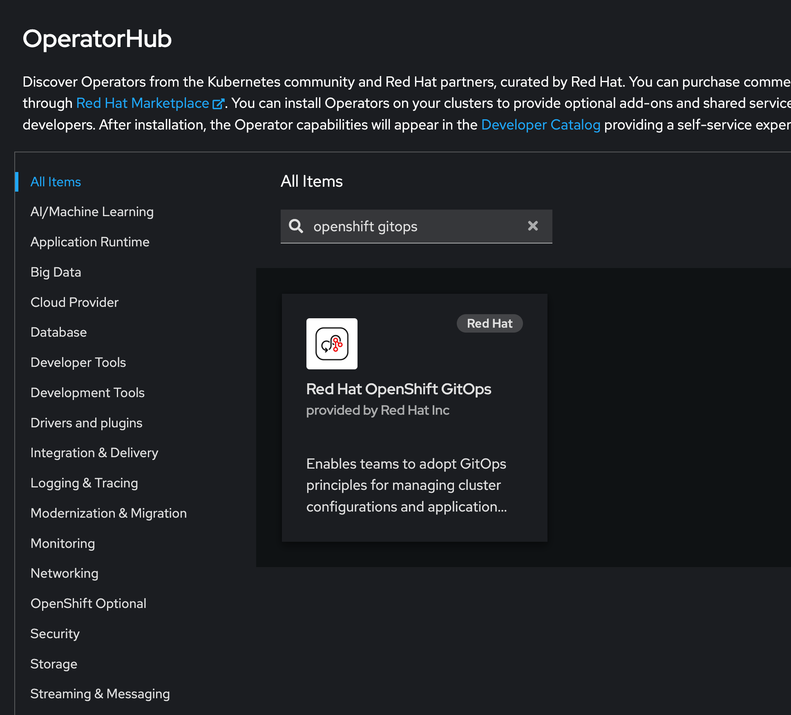
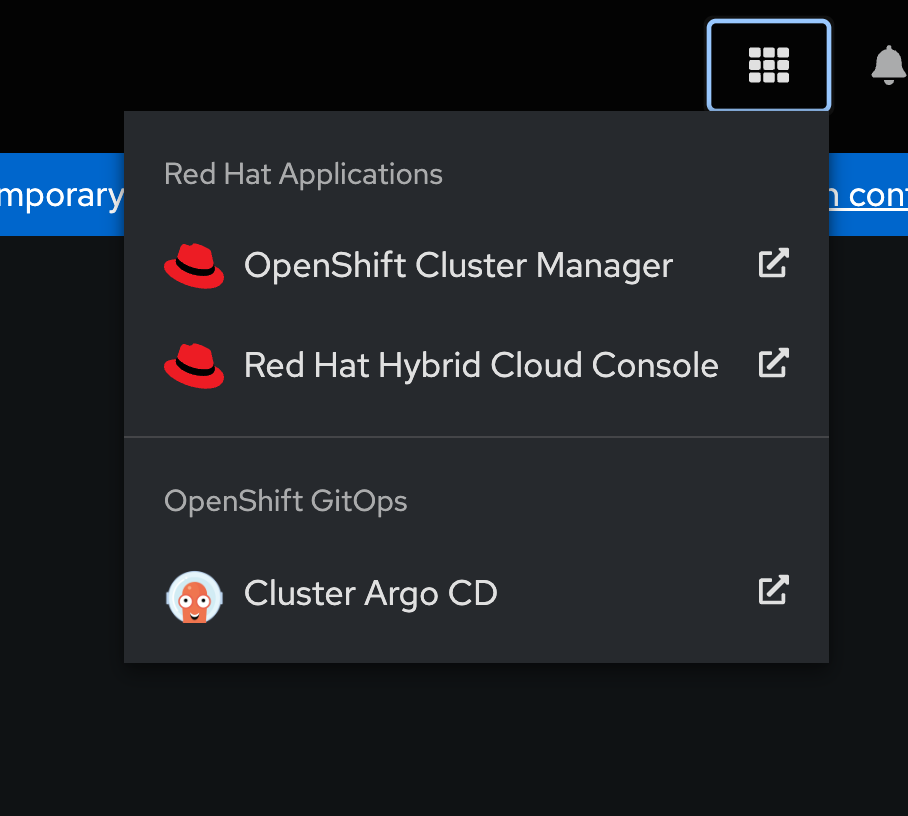
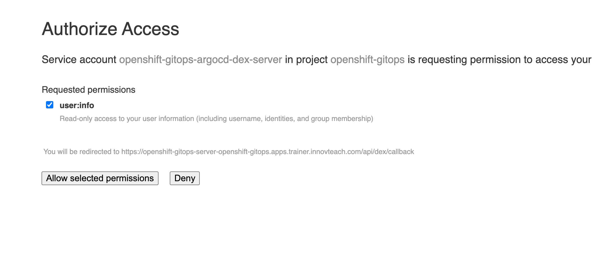
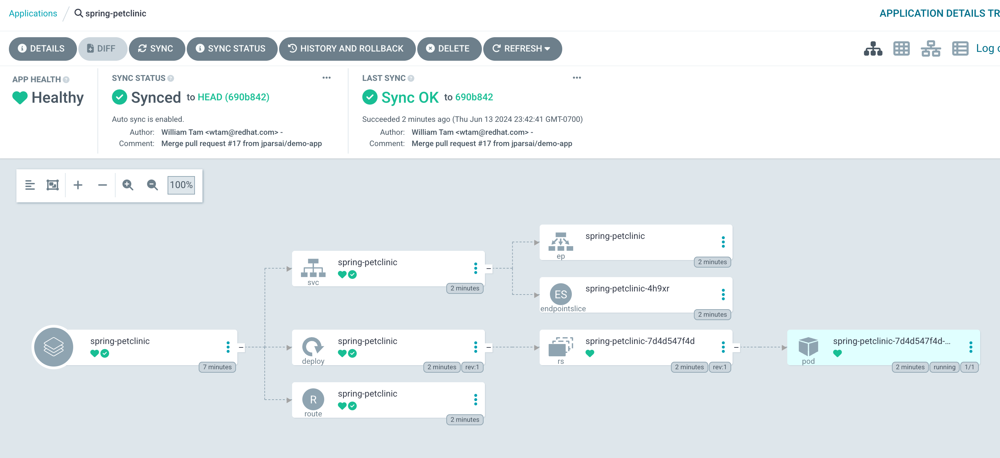

## GitOps Operator

- Install OpenShift GitOps Operator	
  - check "Enable Operator recommended cluster monitoring on this Namespace"
  - Accept defaults
  - Click **Install**



- Wait for a few minutes. Check Argo CD's pods in the `openshift-gitops` namespace

  ```bash
  oc get pods -n openshift-gitops
  ```

  Output

  ```bash
  NAME                                                          READY   STATUS    RESTARTS   AGE
  cluster-699744d6dd-cdzhw                                      1/1     Running   0          73s
  gitops-plugin-7ddd7d4479-s29x6                                1/1     Running   0          73s
  kam-687d6458f6-4g74j                                          1/1     Running   0          73s
  openshift-gitops-application-controller-0                     1/1     Running   0          71s
  openshift-gitops-applicationset-controller-5f696c58cd-f9f2w   1/1     Running   0          71s
  openshift-gitops-dex-server-66db79948d-wg28w                  1/1     Running   0          71s
  openshift-gitops-redis-6cd56f9d5d-wxfpl                       1/1     Running   0          71s
  openshift-gitops-repo-server-6ccfd57845-gpl6f                 1/1     Running   0          71s
  openshift-gitops-server-fff4f5c87-s2647                       1/1     Running   0          71s
  ```

- Wait until all the pods are `Running`

  

- Access ArgoCD Console. 

  - In the top right of the web console, click the icon shown in the screenshot and click "Cluster Argo CD".

    

  There are multiple ways to log into the Argo CD console. You can login using your OpenShift credentials or use the following process to login with the generated credentials. 

  

  If you use the OpenShift method, login as the `kubeadmin` user and grant access to the service account. 

  If you choose NOT to log in with OpenShift credentials run the following. 

  Get the `admin` user's password from the cluster secret:

  - Extract password from secret

    ```bash
    PASSWORD=$(oc extract secret/openshift-gitops-cluster -n openshift-gitops --to=-) 2>/dev/null
    echo $PASSWORD
    ```

  

  #### Log into the Argo CD web console 

  In the web browser, go to the Argo CD portal and log in with the method you chose above. 

  * In the Argo CD dashboard, click **NEW APP** to add a new Argo CD application.

  For this workflow, create a **spring-petclinic** application with the following configurations:

  - Application Name

    `spring-petclinic`

  - Project

    `default`

  - Sync Policy

    `Automatic`

  - Check `AUTO-CREATE NAMESPACE`

  - Repository URL

    `https://github.com/redhat-developer/openshift-gitops-getting-started`

  - Revision

    `HEAD`

  - Path

    `app`

  - Destination

    `https://kubernetes.default.svc`

  - Namespace

    `spring-petclinic`

  - Click **CREATE** to create your application.

  * Open the **Administrator** perspective of the OpenShift web console and expand **Administration** → **Namespaces**.

  * Search for and select the namespace, Under **Labels**, click **Edit** and then enter `argocd.argoproj.io/managed-by=openshift-gitops` and hit `Enter`. This will allow the Argo CD instance in the `openshift-gitops`namespace to create resources in the namespace.

  * Confirm in the Argo CD console the application was synced successfully.

    

Explore the Argo console. There are many helpful options, like viewing the logs of deployed applications. 

### Congratulations! 

You have successfully set up Argo CD to monitor a GitHub repository and apply any detected changes. 


### Bonus! 

If you're feeling adventurous, fork the `spring-petclinic` repository and make a change to the code, commit it, and push it to GitHub. You will see Argo start syncing the changes to the cluster. 
