# Backing up and Restoring Applications with OADP

## Overview

OpenShift API for Data Protection (OADP) 4.15 offers a robust solution for data protection by integrating the OADP Operator, Velero, and Restic to enable seamless backup and recovery of applications and data. This hands-on lab will guide you through the steps of deploying a sample WordPress application with a MariaDB database backed by a persistent volume, performing backups, simulating data loss by deleting the project, and restoring it to verify the backup's integrity and effectiveness.

## Adding the Bitnami Helm Repository

To add the Bitnami Helm repository in OpenShift, switch to the **Developer** view in the OpenShift Web Console and click on **Helm**.

- **Access Helm**: Click on **Helm**.
  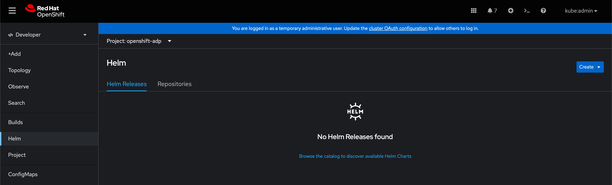

- **Add Repository**: Click **Create** -> **Repository**, and fill in the form as shown.
  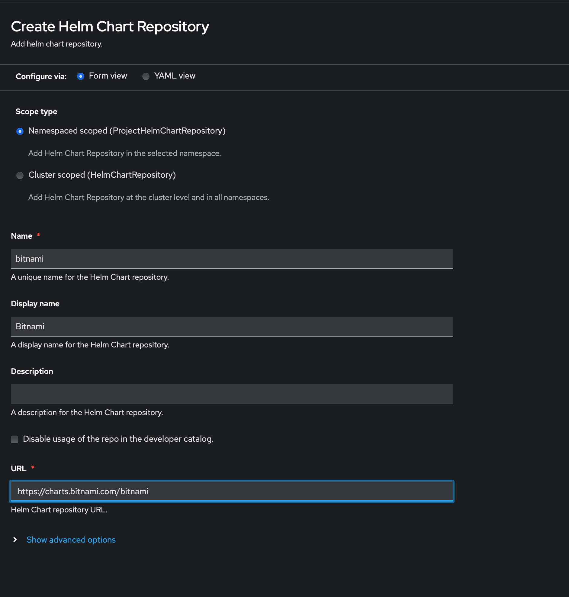

- **Confirm Repository Addition**: To confirm the repository was added correctly, click **Repositories** at the top of the page. You should see the new "bitnami" repository listed.
  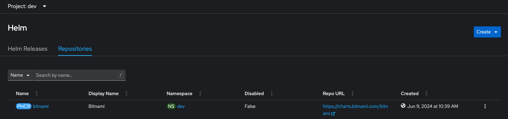

## Deploying the WordPress Chart

To deploy the WordPress chart using Helm:

* Create a new project named **dev**, and change to it.

- Click **+Add**.
  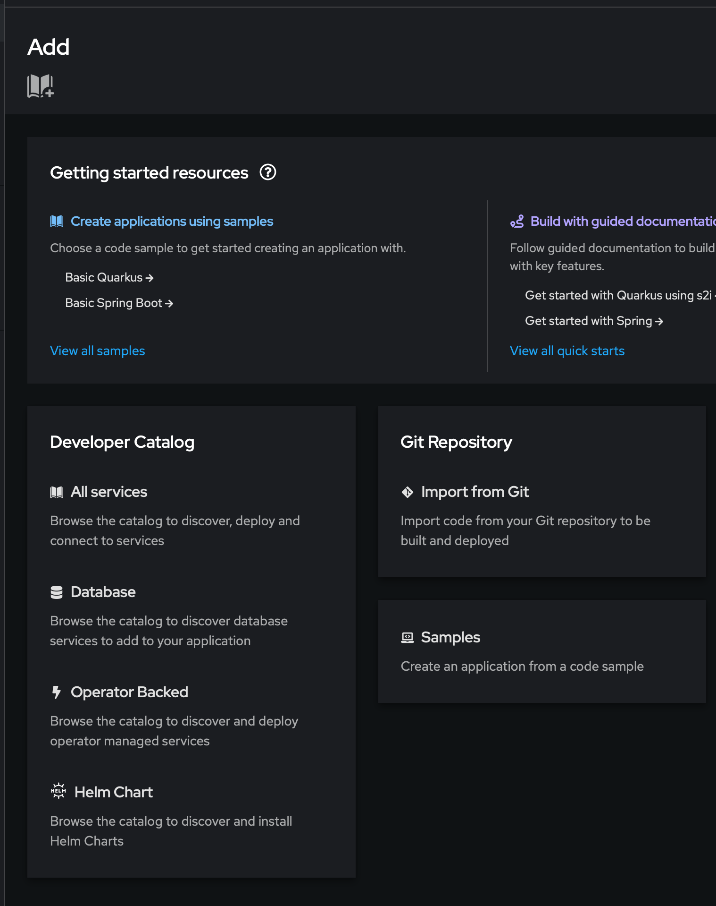

- Search for "wordpress" and select the one that does NOT say "DEPRECATED".
  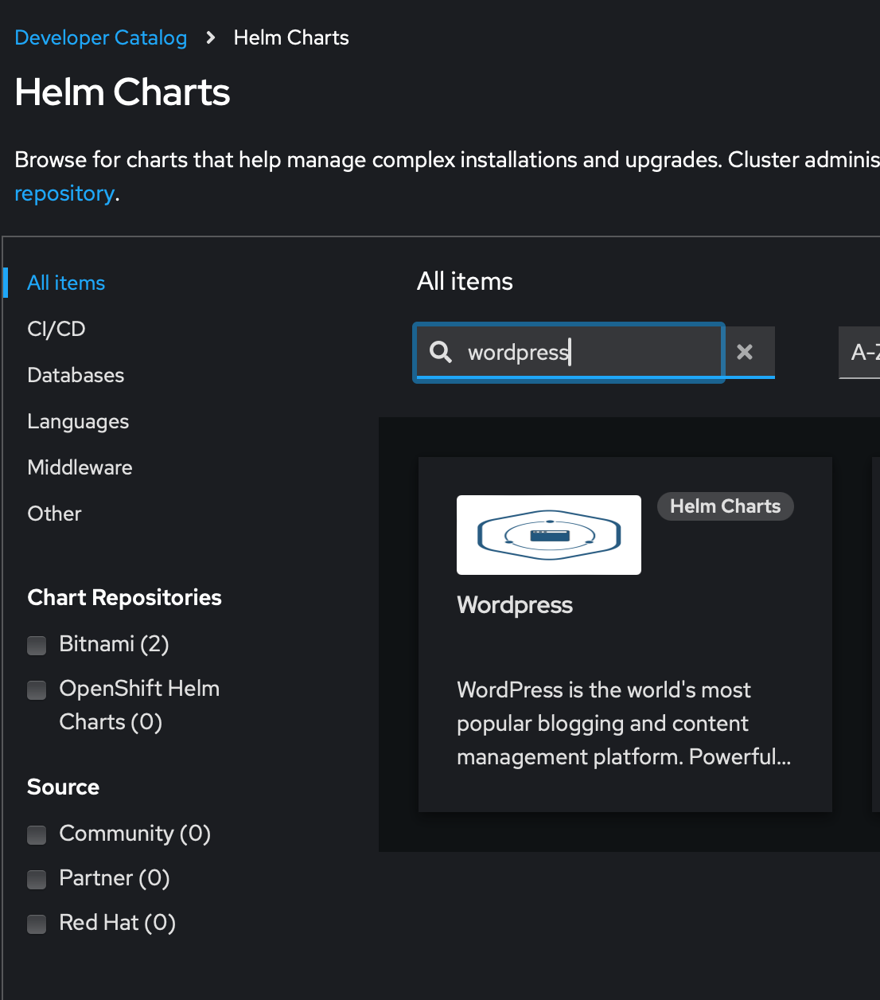

- Click **Create**, and fill out the form as shown. Be sure to use your name for the "Blog Name" field.
  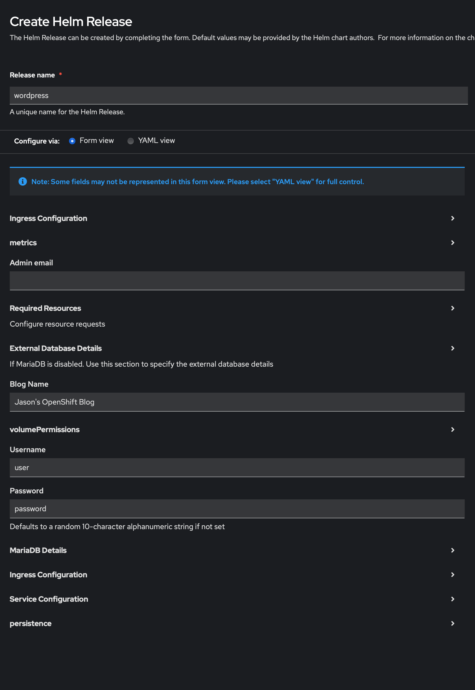

- Click **Create**. You will see the resources being deployed.

- To verify WordPress was deployed successfully, click the square with an arrow icon to load the website. 

  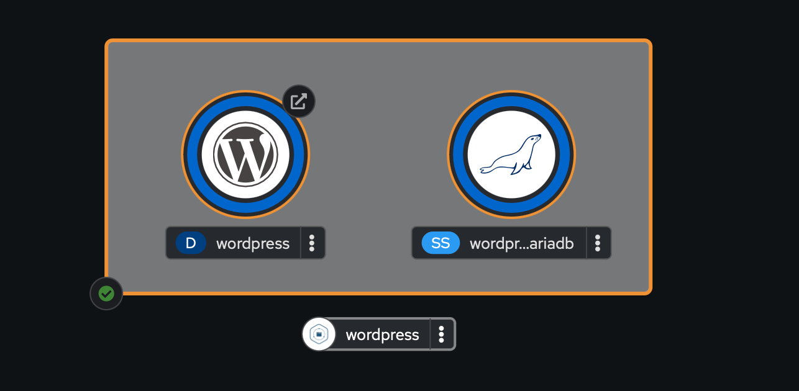

- Log into the WordPress site using credentials:

  - Username = **user**
  - Password = **password**
  - Create a new page called **OADP**, and publish it.

- Congratulations! You've successfully deployed the WordPress application.

## Setting Up OADP

To set up OADP:

- Change to **Administrator** view.
- Click **Operators** -> **OperatorHub**.
- Search for "OADP" and select the Red Hat OADP Operator.
  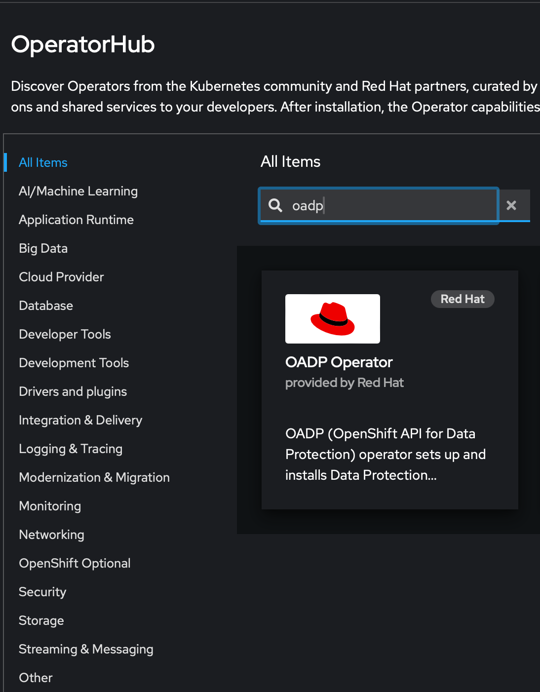
- Click **Install**.
  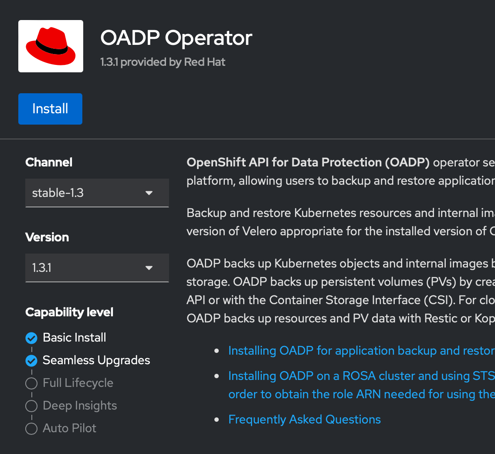

## Creating Cloud Credentials Secret

To create a secret containing your cloud credentials:

- Use the following YAML to create the secret.
   ```yaml
   apiVersion: v1
   data:
     cloud: W2RlZmF1bHRdCmF3c19hY2Nlc3Nfa2V5X2lkPUFLSUFRSkZTV1dSQ1BNTVpTU01WCmF3c19zZWNy
   ZXRfYWNjZXNzX2tleT0yVnhnTExoS2RVa1l3dDgySHVuR0dKMFd5NjUyQTdPMzdscGMrZEdyCg==
   kind: Secret
   metadata:
     name: cloud-credentials
     namespace: openshift-adp
   ```
   
- In the Web Console, expand **Workloads**, and click **Secrets**. Confirm you're in the "openshift-adp" project, and click **Create** -> **From YAML**. Paste in the code from above and click **Create**.
  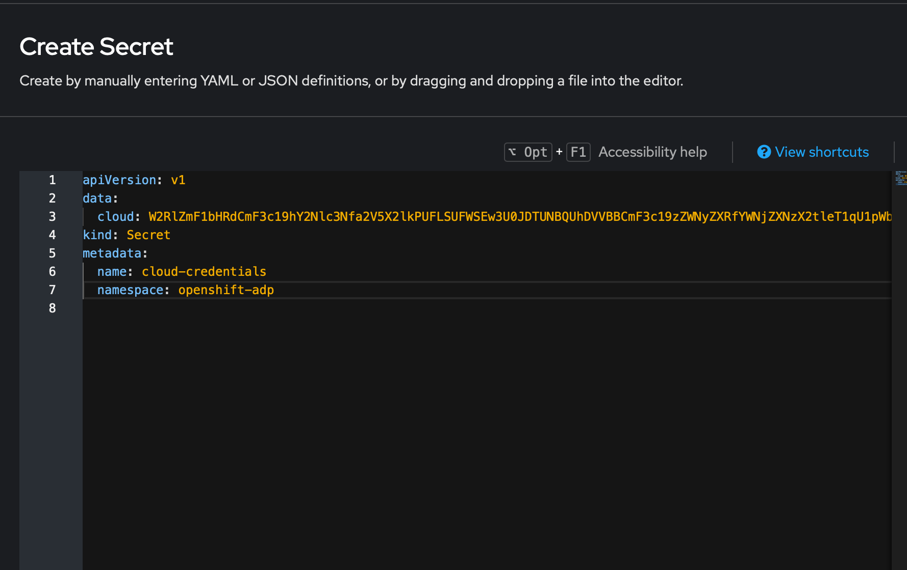

## Creating DataProtectionApplication Custom Resource

To create the DataProtectionApplication Custom Resource:

- Create an instance of the DataProtectionApplication (DPA) CR by clicking on **Create Instance** as highlighted below.
  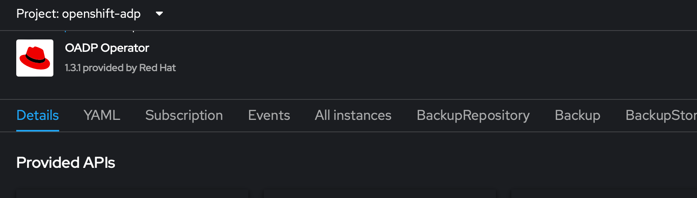

  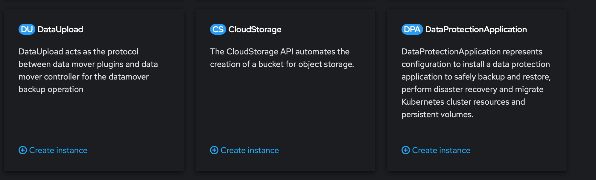
  
- **Use the following YAML File, replacing YOUR_INITIALS and YYYYMMDD**:
  
   ```yaml
   apiVersion: oadp.openshift.io/v1alpha1
   kind: DataProtectionApplication
   metadata:
     name: dpa-sample
     namespace: openshift-adp
   spec:
     backupLocations:
     - name: default
       velero:
         config:
           profile: default
           region: us-west-1
         credential:
           key: cloud
           name: cloud-credentials
         default: true
         objectStorage:
           bucket: <YOUR_INITIALS>-<YYYYMMDD>
           prefix: oadp
         provider: aws
     configuration:
       nodeAgent:
         enable: true
         uploaderType: restic
       velero:
         defaultPlugins:
         - openshift
         - aws
     snapshotLocations:
     - velero:
         config:
           profile: default
           region: us-west-1
         provider: aws
   ```
   
- Click **Create** to create the new **DPA**

## Verifying the Installation

To verify the installation run the following in a terminal:

- **Verify Resources**: Run the following command to verify all the correct resources have been created:
   ```bash
   oc get all -n openshift-adp
   ```
   Expected output:
   ```
   Warning: apps.openshift.io/v1 DeploymentConfig is deprecated in v4.14+, unavailable in v4.10000+
   NAME                                                    READY   STATUS    RESTARTS        AGE
   pod/node-agent-5nknw                                    1/1     Running   0               3h27m
   pod/node-agent-z4kt8                                    1/1     Running   0               3h32m
   pod/openshift-adp-controller-manager-666c6f7f4c-54nlm   1/1     Running   0               14h
   pod/velero-797fc5cbd4-cmh5g                             1/1     Running   1 (3h25m ago)   3h32m
   
   NAME                                                       TYPE        CLUSTER-IP       EXTERNAL-IP   PORT(S)    AGE
   service/openshift-adp-controller-manager-metrics-service   ClusterIP   172.30.106.204   <none>        8443/TCP   14h
   service/openshift-adp-velero-metrics-svc                   ClusterIP   172.30.142.16    <none>        8085/TCP   3h32m
   
   NAME                        DESIRED   CURRENT   READY   UP-TO-DATE   AVAILABLE   NODE SELECTOR   AGE
   daemonset.apps/node-agent   1         1         1       1            1           <none>          3h32m
   
   NAME                                               READY   UP-TO-DATE   AVAILABLE   AGE
   deployment.apps/openshift-adp-controller-manager   1/1     1            1           14h
   deployment.apps/velero                             1/1     1            1           3h32m
   
   NAME                                                          DESIRED   CURRENT   READY   AGE
   replicaset.apps/openshift-adp-controller-manager-666c6f7f4c   1         1         1       14h
   replicaset.apps/velero-797fc5cbd4                             1         1         1       3h32m
   ```

- Verify the DPA has been reconciled:
   ```bash
   oc get dpa dpa-sample -n openshift-adp -o jsonpath='{.status}'
   ```
   Example output:
   ```json
   {"conditions":[{"lastTransitionTime":"2024-06-09T17:17:01Z","message":"Reconcile complete","reason":"Complete","status":"True","type":"Reconciled"}]}
   ```
   Note: The type should be set to "**Reconciled**".

- Run the following command to verify the BackupStorageLocation:
   ```bash
   oc get backupStorageLocation -n openshift-adp
   ```
   Expected output:
   ```
   NAME      PHASE       LAST VALIDATED   AGE     DEFAULT
   default   Available   11s              3h35m   true
   ```
   Note: The PHASE should be "**Available**".


## Backup WordPress


Now that we've installed WordPress, OADP, and configured OADP, we are ready to test it out! 

* Go back to the OADP operator and click **Backup** -> **Create Backup**.

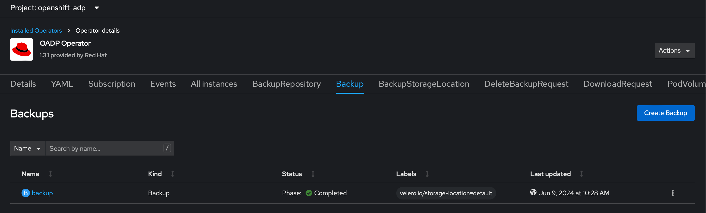

* Fill in the form: 
  * **Name**: backup
  * **storageLocation**: "default"
  * Expand **includedNamespaces** and type "dev"
  * **snapshotVolumes**: Confirm it is checked
* Click **Create**

Monitor the status of the backup and confirm **Phase** changes to **Completed** as shown in the above screenshot.


## Delete the WordPress app and data

* Click **Projects**, and delete the "dev" project. 
* Confirm all the WordPress and MariaDB resources are gone. 
  * `oc get pods -n dev -l app.kubernetes.io/instance=wordpress`


## Restore the dev namespace

Use the OADP restore option to restore the deleted "dev" namespace. 

* In the OADP Operator click **Restore** -> **Create Restore**.
* Fill in the form with the following:
  * **Name**: restore
  * **backupName**: backup
  * Expand **includedNamespaces** and type "dev"
  * **restorePVs**: Confirm it is checked
  * Click **Create**

Monitor the status of the restore and confirm **Phase** changes to **Completed** as shown below.

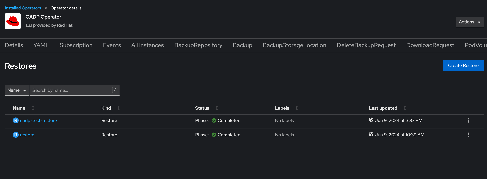


* Now that the restore has completed succesfully, confirm the resources are running.
  * `oc get all -n dev -l app.kubernetes.io/instance=wordpress`
* Confirm the wordpress site loads and shows the new page you created. 

## Schedule backups

We never know when a disaster will occur, so it is best practice to schedule backups to occur frequently. For this lab, we will schedule a backup to occur every five minutes. 

* Navigate to the OpenShift web console.
* Go to the **Operators** section and select **Installed Operators**.
* Choose the **OADP Operator** and go to the **Schedule** tab.
* Create a new schedule to backup up the `dev` namespace, including persistent volumes every five minutes. 
  * TIP: Use this website to help with crontab syntax. https://crontab-generator.org
* Monitor the incremental backup process in the **Backup** section.
* Confirm the backup runs successfully.

## Congratulations 

---

Congratulations on completing the lab! You have successfully deployed a WordPress application with a persistent volume attached, installed and configured the OADP provider, created a backup of the WordPress application, destroyed the application and its data, and restored it. This comprehensive exercise has equipped you with the skills necessary to effectively manage and protect applications and data in an OpenShift environment. Well done!
